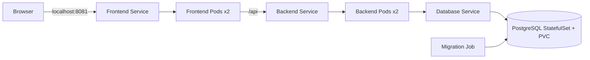

# Kubernetes Todo Lab — практическое задание

## Сценарий

Команда разработки передала Todo-приложение: React frontend, FastAPI backend и
PostgreSQL. Ваша задача как DevOps engineer — контейнеризировать приложение и
воспроизводимо развернуть его в локальном Kubernetes cluster.

Изменять бизнес-логику не требуется. Все infrastructure files создайте сами.
Helm необязателен.

## Целевая архитектура



## Task 1. Изучить приложение

Опишите frontend, backend, database, API endpoints и полный request flow.
Определите необходимые ports и environment variables. Не коммитьте реальные
credentials.

**Acceptance:** в README есть архитектурная схема и таблица configuration.

## Task 2. Написать Dockerfiles

Создайте production images для frontend и backend:

- frontend использует multi-stage build и Nginx;
- backend запускает Uvicorn/FastAPI;
- добавлены `.dockerignore`;
- containers работают не от root;
- image не содержит `.env`, Git metadata или unnecessary build files.

**Acceptance:** оба images собираются, backend имеет `/health`, frontend отдаёт
HTML и проксирует `/api`.

## Task 3. Создать Docker Compose

Запустите frontend, backend и PostgreSQL. Добавьте named volume, healthchecks,
service dependencies и local-only credentials. Снаружи публикуется только
frontend на `8080`.

```bash
docker compose up --build -d
docker compose ps
curl http://localhost:8081/api/items/
```

**Acceptance:** Todo operations работают, а данные сохраняются после restart.

## Task 4. Создать локальный cluster

Используйте kind или Minikube. Загрузите локальные images в cluster или отправьте
их в разрешённый registry. Зафиксируйте команды в README.

**Acceptance:** `kubectl get nodes` показывает Ready node, Kubernetes использует
images, соответствующие вашему commit.

## Task 5. Развернуть configuration и PostgreSQL

Создайте Namespace, ConfigMap, Secret, ClusterIP Service и StatefulSet с PVC.
Password не должен находиться в Git в открытом виде. Добавьте probes и resources.

**Acceptance:** database Ready, PVC Bound, Service доступен только внутри
cluster; данные сохраняются после удаления database Pod.

## Task 6. Выполнить database migration

Создайте Kubernetes Job для Alembic migration и initial data. Job должен ждать
доступности database, завершаться успешно и не запускаться внутри каждой backend
replica.

**Acceptance:** Job имеет `Complete`, таблица создана, повторный безопасный запуск
не повреждает данные.

## Task 7. Развернуть backend

Создайте Deployment с двумя replicas и ClusterIP Service. Configuration приходит
из ConfigMap/Secret. Добавьте readiness/liveness probes, requests/limits и
restricted security context.

**Acceptance:** две replicas Ready, `/health` проверяет database, Service имеет
endpoints, backend не публикуется через NodePort/LoadBalancer.

## Task 8. Развернуть frontend

Создайте Deployment с двумя replicas и ClusterIP Service. Frontend должен
обращаться к backend через Kubernetes DNS и проксировать `/api`.

```bash
kubectl -n kubernetes-todo port-forward service/frontend 8081:8080
```

**Acceptance:** приложение открывается на `http://localhost:8081`; создание,
изменение и удаление задач работают.

## Task 9. Reliability и rollout

Продемонстрируйте self-healing, scaling, rolling update и rollback:

```bash
kubectl -n kubernetes-todo scale deployment/frontend --replicas=3
kubectl -n kubernetes-todo rollout status deployment/frontend
kubectl -n kubernetes-todo rollout history deployment/frontend
kubectl -n kubernetes-todo rollout undo deployment/frontend
```

**Acceptance:** удалённый Pod восстанавливается, rollout не прерывает доступность,
данные database не теряются.

## Task 10. Security и access control

Добавьте namespace-scoped ServiceAccount, Role и RoleBinding только для чтения
Pods, Services и Deployments. Добавьте NetworkPolicy, разрешающую database traffic
только от backend и migration Job.

**Acceptance:** `kubectl auth can-i` подтверждает разрешённые и запрещённые
operations; database не доступна frontend Pod.

## Task 11. Documentation и защита

README должен содержать prerequisites, architecture, commands, troubleshooting,
rollout/rollback и cleanup. Добавьте безопасные screenshots Pods, Services, PVC,
Job и работающего сайта.

На защите студент показывает localhost через Compose и Kubernetes, удаляет Pod,
проверяет persistence и объясняет request/configuration/secret flow.

## Advanced — необязательно

- NGINX Ingress Controller и Ingress — 3 bonus points;
- HPA с Metrics Server и load demonstration — 3;
- Helm chart или Kustomize overlays — 3;
- canary deployment — 3;
- observability dashboard — 3.

Domain, TLS и cloud deployment не требуются.

## Ожидаемая структура

```text
.
├── backend/
│   ├── Dockerfile
│   └── .dockerignore
├── frontend/
│   ├── Dockerfile
│   ├── .dockerignore
│   └── nginx.conf
├── kubernetes/
│   ├── namespace.yml
│   ├── configmap.yml
│   ├── database.yml
│   ├── database-migration-job.yml
│   ├── backend.yml
│   ├── frontend.yml
│   ├── rbac.yml
│   └── network-policy.yml
├── docker-compose.yml
└── README.md
```

## Критические требования

Проект не получает проходную оценку, если приложение не работает в Kubernetes,
реальные secrets находятся в Git, database опубликована наружу, persistence
отсутствует или студент не может объяснить request flow.
