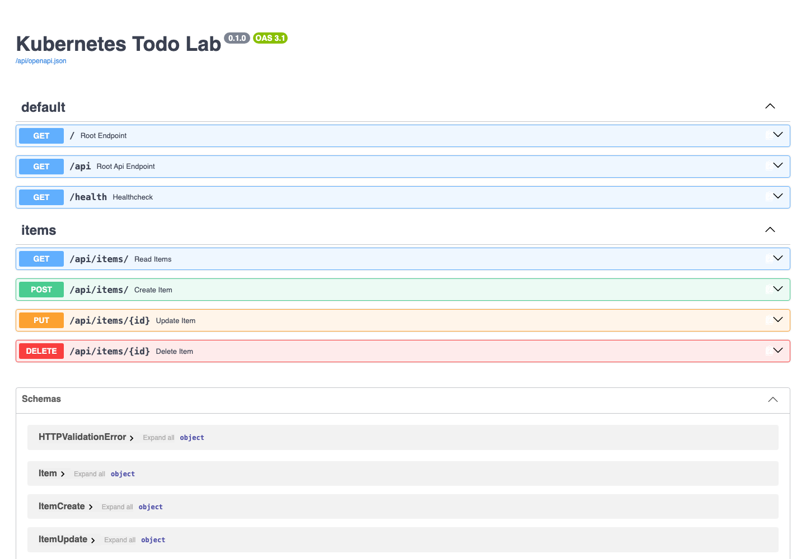

# Kubernetes Todo Lab — Student Starter

[Русский](README.md) | [English](README_EN.md)

This intermediate Kubernetes project is part of the “DevOps from Zero to
Production” program. You receive the application code and must containerize and
deploy it to a local Kubernetes cluster.

## What you receive

- `frontend/` — React 19 and Vite frontend;
- `backend/` — FastAPI backend and Alembic migrations;
- `ASSIGNMENT.md` — tasks and acceptance criteria;
- `PREREQUISITES.md` — required tools and knowledge;
- `GRADING_RUBRIC.md` — 100-point assessment;
- `TROUBLESHOOTING.md` — diagnostic guidance;
- Apache 2.0 attribution and modification notices.

The repository intentionally does not include Dockerfiles, Docker Compose,
Kubernetes manifests, Helm charts, cloud infrastructure, or ready-made secrets.

## Expected result

The backend must also expose interactive FastAPI/OpenAPI documentation:

## Your objective

Build a reproducible environment containing:

- production frontend and backend images;
- a three-service Docker Compose environment;
- a local Minikube or kind cluster;
- Namespace, ConfigMap, Secret, StatefulSet, PVC, migration Job;
- two-replica frontend and backend Deployments;
- ClusterIP Services and Kubernetes DNS;
- health probes, resource requests and limits;
- RBAC, NetworkPolicy, self-healing, rollout, and rollback.

The application must be available:

1. at <http://localhost:8081> through Docker Compose;
2. at <http://localhost:8081> through Kubernetes `port-forward`.

Cloud accounts, Terraform, a paid domain, HTTPS, and Helm are not required.
Ingress, HPA, Helm/Kustomize, canary deployment, and observability are optional
advanced tasks.

Start with [PREREQUISITES.md](PREREQUISITES.md), then read
[ASSIGNMENT.md](ASSIGNMENT.md) and [GRADING_RUBRIC.md](GRADING_RUBRIC.md).

Never commit real credentials, `.env`, private keys, or a populated Kubernetes
Secret manifest.

